## 📘 Calendar Project: Technical Details and Setup Guide

This document complements the main README and provides in-depth guidance on:

* Event sheet setup
* Calendar layout
* Used formulas
* Apps Script functions

---

### 📅 Sheet Overview

| Sheet Name                          | Purpose                                   |
| ----------------------------------- | ----------------------------------------- |
| `Calendar`                          | Displays monthly view, color-coded events |
| `Settings`                          | Controls calendar year and event colors   |
| `Deadline`, `Call`, `Meeting`, etc. | Source data sheets                        |
| `Holidays`                          | Contains recurring and one-time holidays  |
| `Scheduled Events for [date]`       | Auto-generated daily task list            |

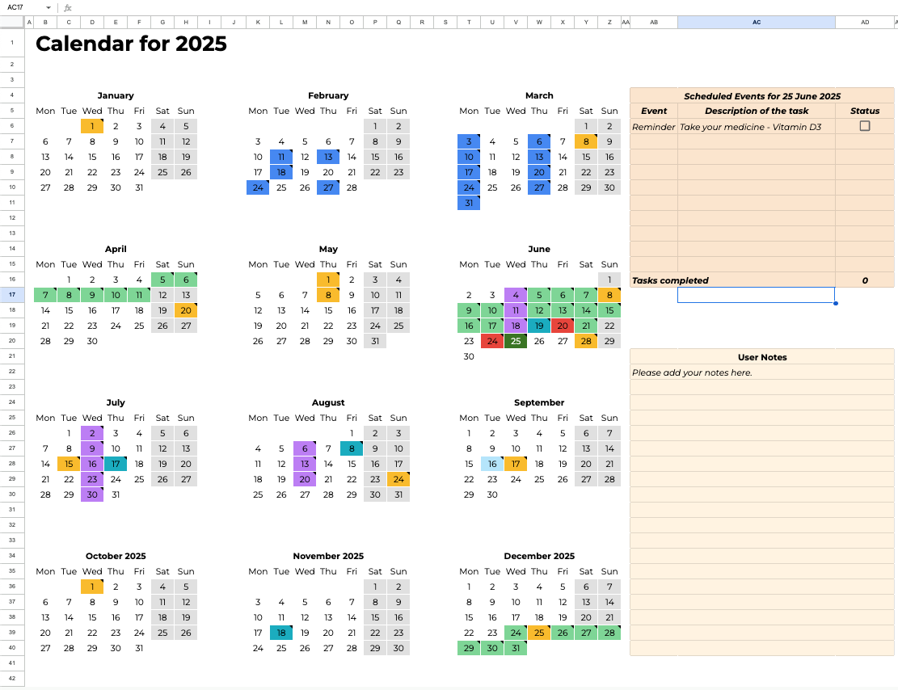
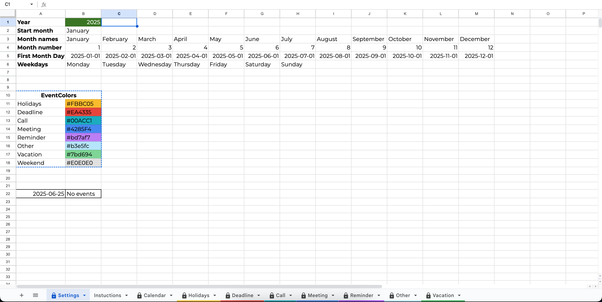
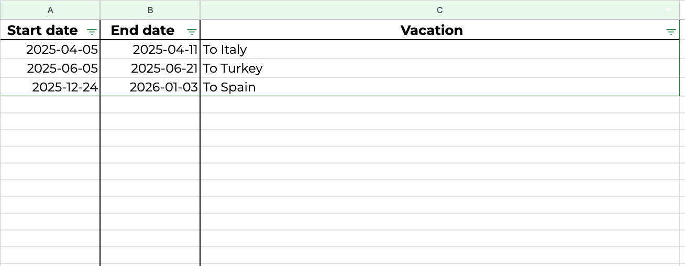
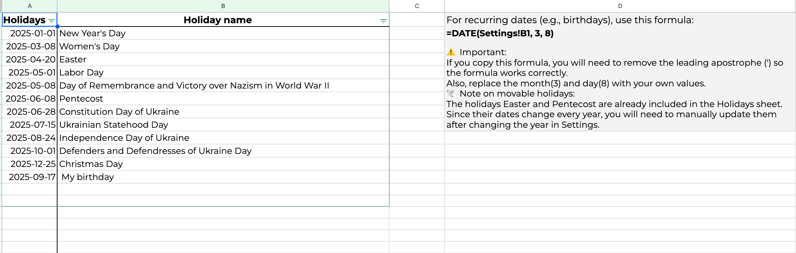

---

#### 🗓️ Recurring Dates (e.g. birthdays)

To make a date change dynamically with the selected year:

```excel
=DATE(Settings!B1, 3, 8)
```
`March 8th of selected year`

⚠️ If you copy this formula from the file, remove the leading apostrophe (`'`) to make it active.

---

### 🧠 How the Calendar Works

1. **Date Range Generation**
* Each month is a 6x7 grid.
* The top-left corner coordinates for each month are stored in the script as `monthsMap`.

2. **Scripts and Triggers**

#### [`updateCalendarNotes`](../scripts/update_calendar_notes.gs)
Adds notes and highlights based on event sheets  
Trigger: **Every 10 min**  
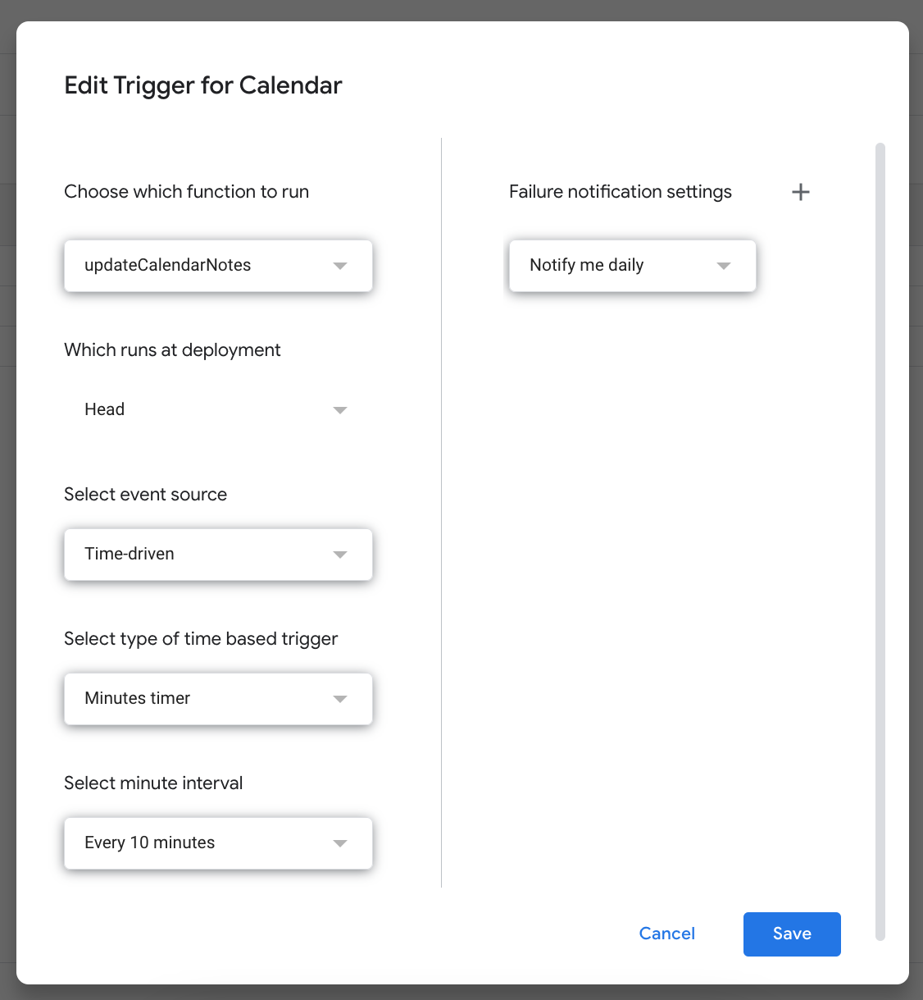

#### [`insertStatusCheckboxes`](../scripts/insert_status_checkboxes.gs)
Inserts empty checkboxes for today's event table  
Trigger: **Every 10 min**  
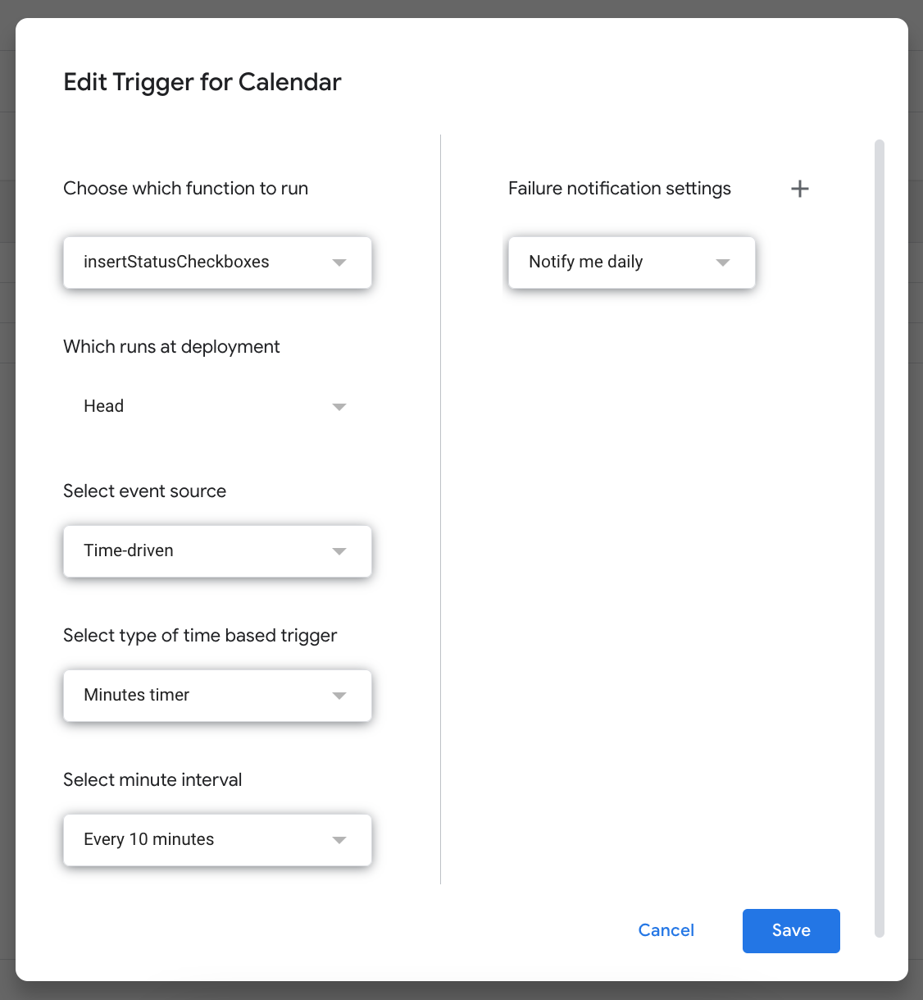

#### [`clearStatusCheckboxes`](../scripts/clear_status_checkboxes.gs)
Clears the checkboxes at midnight for a new day  
Trigger: **Time-driven (daily, 00:00–01:00)**  
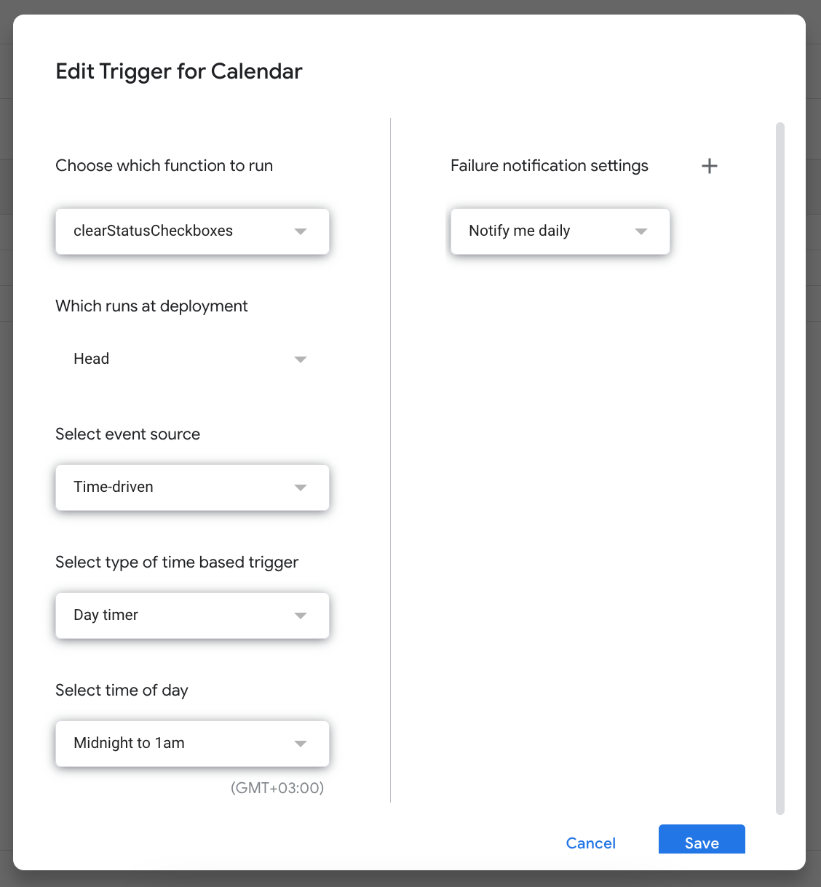

---

### ✅ Checkbox Automation

In the "Scheduled Events for [today]" sheet:

* Events are listed using formulas that scan the event sheets.
* A checkbox is added **only if a description is present** in the row (`AB6:AC15` → checkbox in AD column).
* Checkboxes are cleared daily using a scheduled Apps Script.
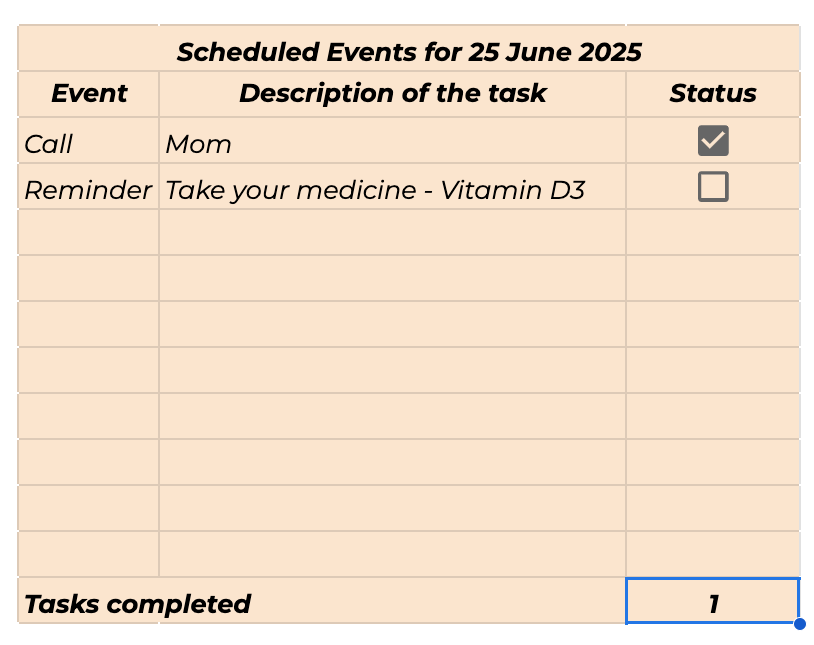

---

### 🎨 Conditional Formatting

These rules are applied to the `Calendar` sheet:

#### ✅ Today — white text on green (`#38761d`)
```excel
=TODAY()
```

#### 📅 Weekends — light gray (`#e0e0e0`)
```excel
=AND(ISNUMBER(A1), ISDATE(A1), OR(WEEKDAY(A1,2)=6, WEEKDAY(A1,2)=7))
```

#### 🎉 Holidays — yellow (`#fbbc05`)
```excel
=AND(ISNUMBER(A1), A1<>"", COUNTIF(INDIRECT("Holidays!A2:A"), A1) > 0)
```

Other rules follow the same pattern but reference different sheets (e.g. Deadline, Call).

#### 🌴 Vacation — light green (`#7bd694`)
```excel
=AND(ISDATE(A1), SUMPRODUCT((A1>=INDIRECT("Vacation!A2:A100"))*(A1<=INDIRECT("Vacation!B2:B100")))>0)
```

🎨 **Event highlight colors** are defined and customizable in the `Settings` sheet.

To adjust event color priority:

* Go to `Calendar` → `Format` → `Conditional formatting`
* Use the three dots next to each rule to reorder them

Recommendation:

* Place the "Today" highlight rule at the top
* Place the "Weekend" highlight rule at the bottom

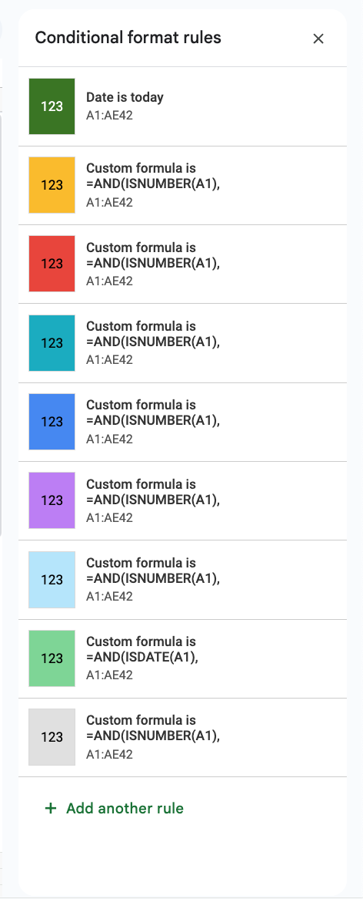

---

### 🕊️ Movable Holidays

Some holidays like **Easter** and **Pentecost** change yearly. Their dates **must be updated manually** in the `Holidays` sheet after changing the year.

---

### 🛡️ Protection

* Sheet protection is applied to core sheets (Calendar, Settings, etc.)
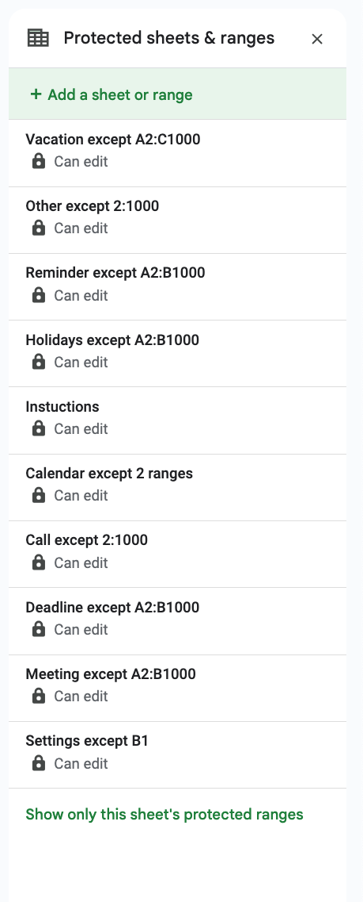


* When copying the file:

  * Protections are **not** preserved (you gain full access)
  * You can reapply protections manually via `Tools → Protect sheet`

---

### 📎 Notes

* Avoid leaving empty rows in event sheets
* Do not manually edit `Calendar` or the daily event table — these are script-managed
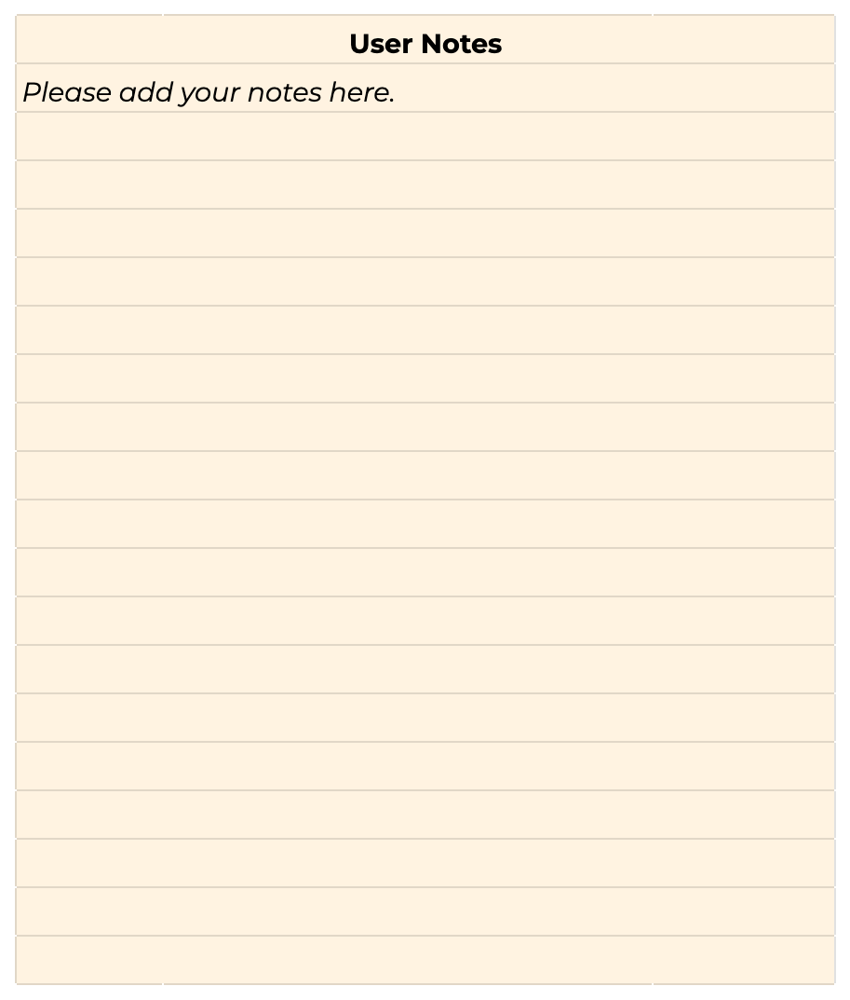

---

Need help with custom logic or formulas? Feel free to open an issue in the main repo!
